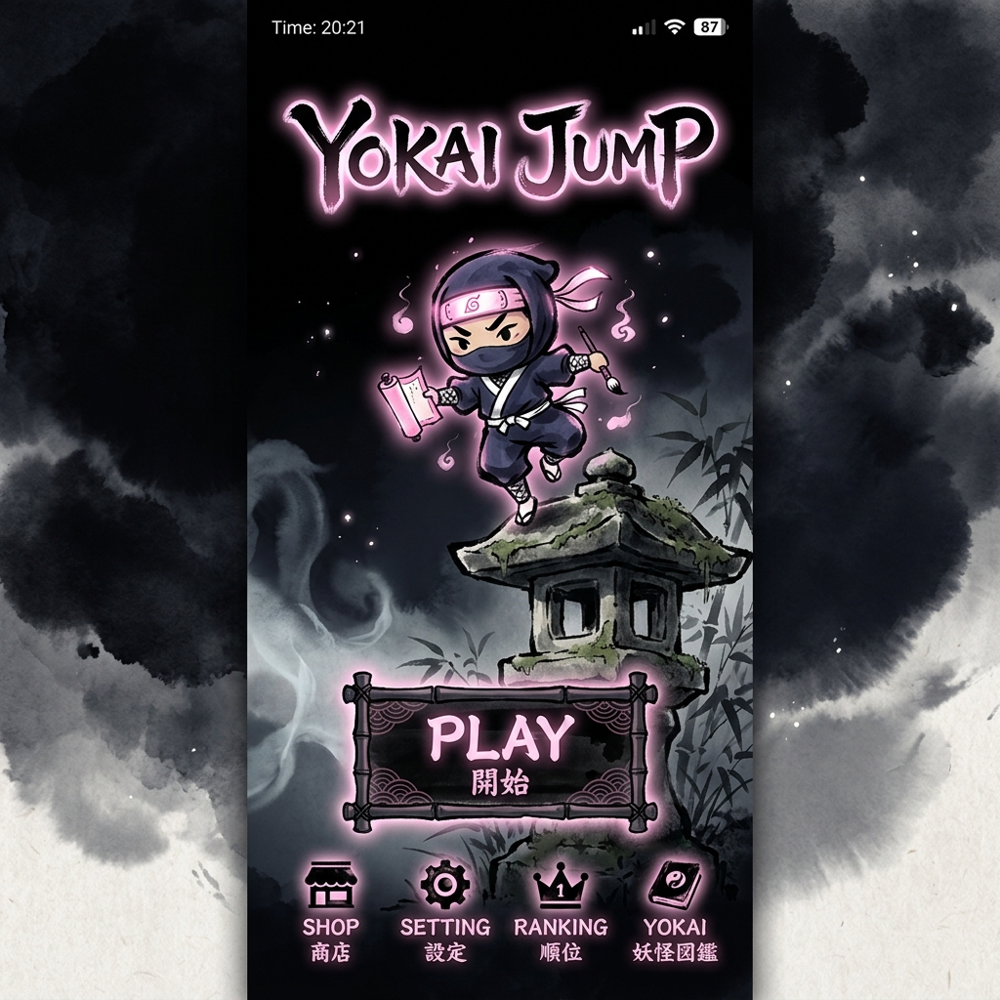
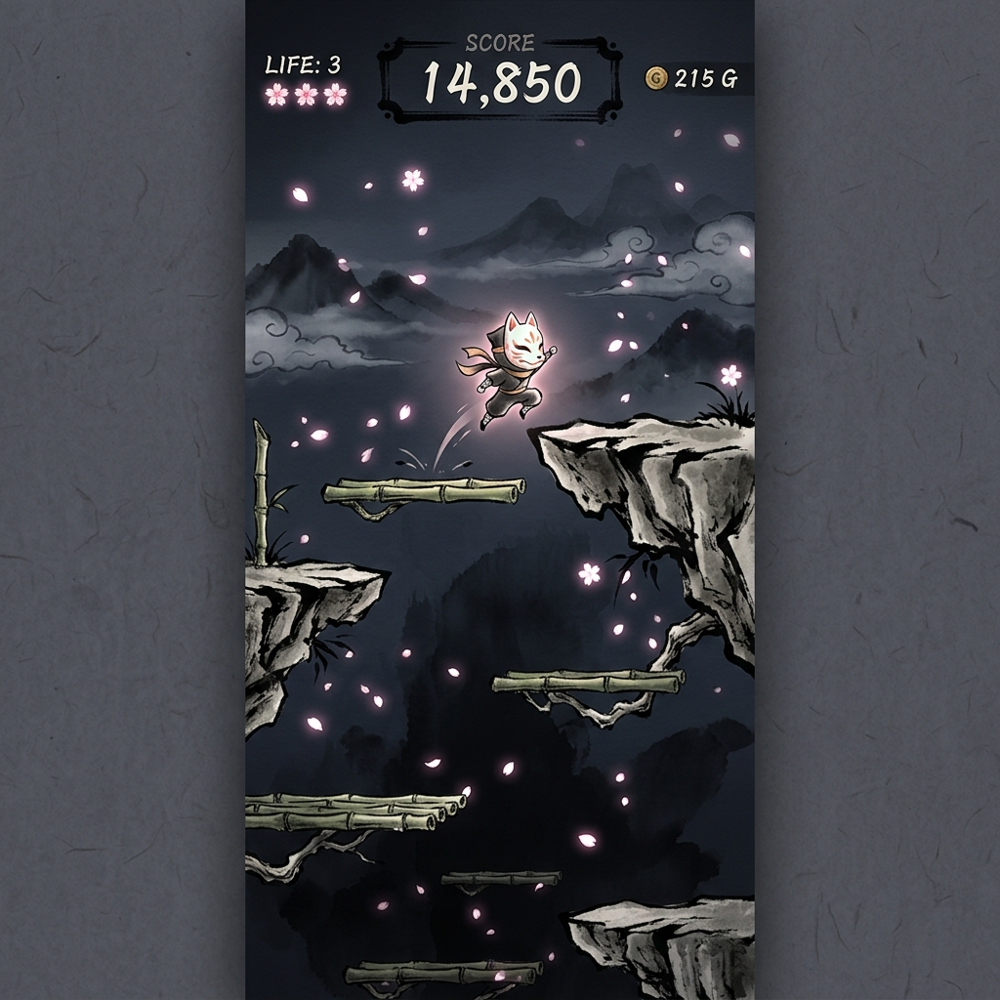

<div align="center">

# YOKAI JUMP


---

**[JOUER EN LIGNE](https://max2405031.github.io/doodle-jump/)** | **[APK Android](#)** | **[App Store](#)**

</div>

---

## Apercu du jeu

<p align="center">
  
  
</p>

---

## Le Concept

> *Plongez dans un univers mythologique japonais. Incarnez un petit esprit gardien courageux et entreprenez une ascension sans fin vers les cieux !*

**Yokai Jump** est un jeu de plateforme vertical infini ou vous incarnez un petit yokai devant grimper le plus haut possible. Sautez de plateforme en plateforme, esquivez ou combattez les demons, et recuperez des artefacts legendaires pour monter toujours plus haut et dominer le classement.

---

## Comment Jouer ?

L'objectif est simple : monter le plus haut possible sans tomber ni vous faire toucher par un ennemi. Votre personnage rebondit automatiquement a chaque fois qu'il touche une plateforme. Vous ne controlez que sa direction gauche/droite et ses tirs !

**Controles sur Ordinateur :**
- Deplacement : Touches **Fleche Gauche / Fleche Droite** (ou **A / D**)
- Attaquer : Touche **Espace** pour lancer un shuriken
- Mettre en pause : **Echap**

**Controles sur Smartphone / Tablette :**
- Deplacement : Inclinez votre telephone (le gyroscope est detecte) ou touchez les cotes gauche et droit de l'ecran.
- Attaquer : Touchez le centre de l'ecran.

**Astuces de survie :**
- **Traversez l'ecran :** Si vous sortez par la gauche de l'ecran, vous reapparaitrez par la droite ! Utilisez cela a votre avantage.
- **Traversez les planches :** Vous pouvez traverser les plateformes par en-dessous pendant que vous montez. Vous n'atterrirez dessus que lorsque vous retomberez.
- **Sauts sur les ennemis :** Si vous atterrissez sur la tete d'un monstre, vous le vaincrez tout en prenant un fort elan vers le haut !

---

## Direction Artistique & Ambiance Audio

### Theme Visuel : Mythologie Japonaise
L'identite visuelle puise son inspiration du Japon feodal et des mythes traditionnels. Le jeu est genere entierement de maniere procedurale au chargement via l'API Canvas de HTML5 (pas un seul fichier image classique a charger) :
- Esthetique Sumi-e : Arriere-plans en lavis d'encre avec des montagnes qui evoluent (Village, Foret, Neige, Cosmos).
- Parallax dynamique : Multiples couches de profondeur creant une veritable immersion 3D en 2D.
- Effets meteo : Chute de petales de Sakura, lucioles dans la nuit, orages.
- Palette vibrante : Tons harmonieux allant du Sakura Pink profond au Bamboo Green.

### Ambiance Sonore (Sound Design)
L'audio est synthetise en grande partie mathematiquement en temps reel via l'API WebAudio, accompagne par un doux fond musical d'ambiance.
- Musique relaxante : Theme de village traditionnel (ogg) en arriere-plan.
- SFX adaptes a chaque action : 
  - Saut & Rebond : des variations sonores selon le type de plateforme.
  - Menus & UI : sons de clics, survols, et achats pour une navigation satisfaisante.
  - Combats & Score : lancement de shuriken, elimination d'ennemi, collecte de power-up, etc.
- Reglage independant : Dans les options, vous pouvez regler separement le volume de la musique et des bruitages.

---

## Les Plateformes

Chaque plateforme a un comportement unique :

- Lanterne de pierre (Marron) : Stable, elle ne bouge jamais. La base sure.
- Bambou (Vert) : Se deplace horizontalement, il faut suivre le rythme !
- Kumo / Nuage (Blanc, transparent) : Disparait apres un rebond, ne restez pas dessus !
- Lotus (Rose) : Trampoline puissant qui vous propulse bien plus haut !
- Glace (Bleu glace) : Se brise au contact, passez vite !

---

## Bestiaire Yokai

Les adversaires qui bloqueront votre ascension :

- Kappa (Vert, tortue) : Flotte horizontalement, vitesse moyenne.
- Tengu (Rouge, masque) : Vole en suivant des vagues.
- Karakasa (Violet, parapluie) : Sautille verticalement comme un ressort.
- Oni (Orange, geant) : Lent mais massif, encaisse plusieurs coups.
- Gashadokuro (Squelette geant) : Boss tres dangereux, intouchable.

---

## Power-ups Legendaires

Recuperez des objets pour inverser la situation :

- Katana : Invincibilite et destruction des Yokai au contact (5 secondes)
- Daruma : Bouclier qui absorbe un coup mortel (Jusqu'a utilisation)
- Koi Nobori : Montee automatique tres rapide type jetpack, invincibilite totale (4 secondes)
- Maneki Neko : Aimante tous les objets bonus vers vous (6 secondes)

---

## Demarrage Rapide

### Installation

```bash
git clone git@github.com:max2405031/doodle-jump.git
cd doodle-jump
npm install
```

### Developpement

```bash
npm run dev
# Ouvre http://localhost:8081
```

### Build Production

```bash
npm run build
# Output dans /dist
```

### Deploiement Mobile (Capacitor)

```bash
# Build et sync iOS
npm run cap:build:ios
npx cap open ios

# Build et sync Android
npm run cap:build:android
npx cap open android
```

---

## License

All Rights Reserved.

Le code source est mis a disposition uniquement pour la lecture et l'apprentissage. Aucun usage commercial, modification, redistribution, ou creation de travaux derives n'est autorise.

(Le code de base d'origine est inspire du travail de TorresjDev/TS-Phaser-Game-Jumper sous licence MIT).

---

<div align="center">
Fait avec passion
</div>
